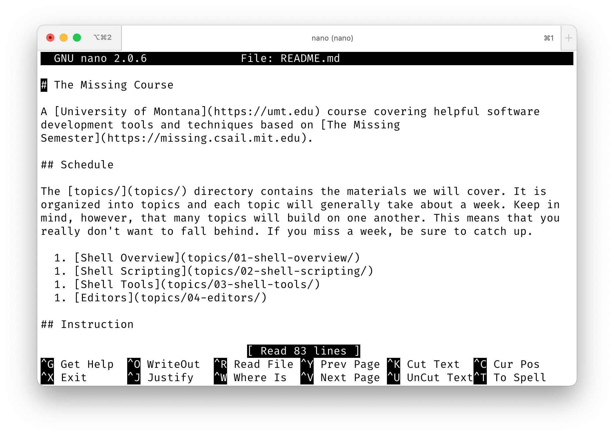
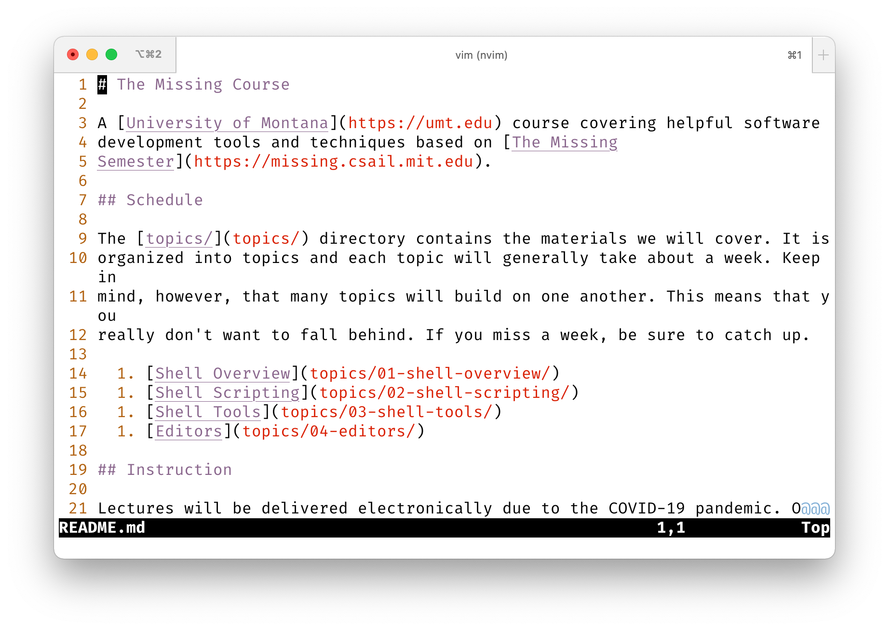

# Editors

We won't spend too much time talking about editors because there are so many of
them in existence and they represent such a subjective, personal choice on the
part of individual users. However, it is good to be familiar with at least a
couple of standard Unix editors since they are essentially ubiquitous and we
don't always have access to our preferred one in all circumstances.

## Nano

Nano is a simple editor that has very few features but is also trivial to learn.
It is common to see people new to Unix using Nano, and there's nothing wrong
with that.

```
nano <file>
```



Note that keyboard shortcuts are displayed at the bottom of the screen, perfect
for new or infrequent users!

## Vim

Vim is kind of the anti-Nano. It is extremely powerful, but rather difficult to
learn.

```
vim <file>
```



There is a common joke that the only way to exit Vim is to shut off the
computer. Can you see why?

## Emacs

A common joke about Emacs is that it is a great operating system that just lacks
a text editor. There is some strange truth to this, and if you decide to drink
enough of the Kool-Aid you'll understand why.

